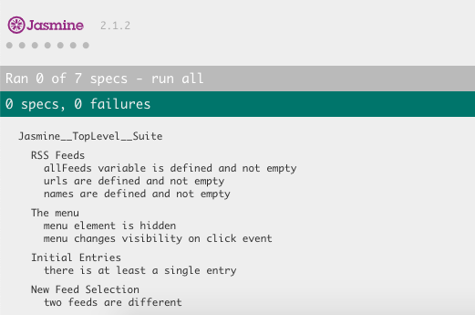

## Table of Contents

* [Project Overview](#project-overview)
* [How to run the application?](#how-to-run-the-application-?)
* [What does this test check?](#what-does-this-test-check-?)
* [Built with](#built-with)

## Project Overview

This is the fifth project of the Udacity's Nanodegree Front-End Developer.
The goal of the project is to learn how to use [Jasmine](https://jasmine.github.io/) - an open source testing framework for JavaScript.

Further instructions of Udacity can be found [here](https://github.com/udacity/frontend-nanodegree-feedreader).

## How to run the application?

Download the files and save them in a folder. Then open the index.html file in a browser.

## What does this test check?

- If allFeeds variable is defined and not empty
- If allFeeds variable has URLs and they are not empty
- If allFeeds variable has names and they are not empty
- If the menu element is hidden
- If the menu changes its visibility on click event
- When the loadFeed function is called and completes its work, there is at least a single .entry element within the .feed container
- When a new feed is loaded by the loadFeed function that the content changes.

## Built with

The starter code and the assets were already provided by the Udacity. The test was built with the following languages and resources:

- HTML
- CSS
- JavaScript
- JQuery
- Jasmine framework
